# **Traffic Sign Recognition**

## Writeup

---

**Build a Traffic Sign Recognition Project**

The goals / steps of this project are the following:
* Load the data set (see below for links to the project data set)
* Explore, summarize and visualize the data set
* Design, train and test a model architecture
* Use the model to make predictions on new images
* Analyze the softmax probabilities of the new images
* Summarize the results with a written report

[//]: # (Image References)

[image1]: ./examples/visualization.jpg "Visualization"
[image2]: ./examples/grayscale.jpg "Grayscaling"
[image3]: ./examples/random_noise.jpg "Random Noise"
[image4]: ./examples/placeholder.png "Traffic Sign 1"
[image5]: ./examples/placeholder.png "Traffic Sign 2"
[image6]: ./examples/placeholder.png "Traffic Sign 3"
[image7]: ./examples/placeholder.png "Traffic Sign 4"
[image8]: ./examples/placeholder.png "Traffic Sign 5"

## Rubric Points
### Here I will consider the [rubric points](https://review.udacity.com/#!/rubrics/481/view) individually and describe how I addressed each point in my implementation.  

---
### Writeup / README

You're reading it! and here is a link to my [project code](https://github.com/AaronLPS/CarND-Traffic-Sign-Classifier-P2-master/blob/master/Traffic_Sign_Classifier.ipynb)

### Data Set Summary & Exploration

#### 1. Provide a basic summary of the data set. In the code, the analysis should be done using python, numpy and/or pandas methods rather than hardcoding results manually.

I used the pandas library to calculate summary statistics of the traffic
signs data set:

* The size of training set is 34799
* The size of the validation set is 4410
* The size of test set is 12630
* The shape of a traffic sign image is (34799, 32, 32, 3)
* The number of unique classes/labels in the data set is 43

#### 2. Include an exploratory visualization of the dataset.

Here is an exploratory visualization of the data set.
The following images are samples from training data set:
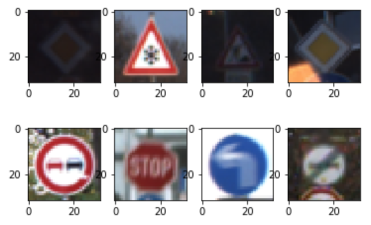
The distribution of samples in each category is listed here:
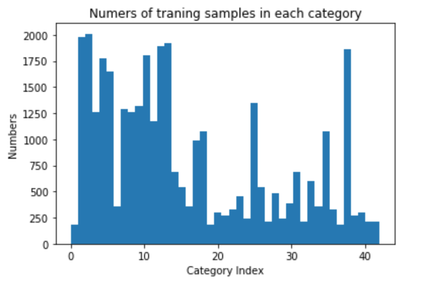

### Design and Test a Model Architecture

#### 1. Describe how you preprocessed the image data. What techniques were chosen and why did you choose these techniques? Consider including images showing the output of each preprocessing technique. Pre-processing refers to techniques such as converting to grayscale, normalization, etc. (OPTIONAL: As described in the "Stand Out Suggestions" part of the rubric, if you generated additional data for training, describe why you decided to generate additional data, how you generated the data, and provide example images of the additional data. Then describe the characteristics of the augmented training set like number of images in the set, number of images for each class, etc.)

As a first step, I decided to convert the images to grayscale because the meaning of traffic signs can also be recognised from grayscale Images. The benefit of grayscale images is that it reduce the complexity of the target problem. Thus it will reduce the complexity of the NN model.

I normalized the image data for accelerating the convergence of the optimisation.

Here is an example of a traffic sign image before and after grayscaling.

![alt text][image2]

#### 2. Describe what your final model architecture looks like including model type, layers, layer sizes, connectivity, etc.) Consider including a diagram and/or table describing the final model.

My final model consisted of the following layers:

| Layer         		|     Description	        					|
|:---------------------:|:---------------------------------------------:|
| Input         		| 32x32x1 grayscale image   							|
| Convolution 5x5 (conv_1)     	| 2x2 stride, same padding, outputs 14x14x8 	|
| RELU					|												|
| Convolution 3x3 (conv_2)	    | 2x2 stride, same padding, outputs 6x6x16       									|
| RELU  |   |
|  Convolution 3x3 (conv_3)  | 2x2 stride, same padding, outputs 2x2x43 |
| RELU  |   |
|Concatenate flattened layers: concat_conv = [flatten_conv_2, flatten_conv_3]   | outputs 1x748  |
| Fully connected		| outputs 1x256       									|
| Fully connected  | outputs 1x43   |

Given the support of Tensorboard, the visualisation of the proposed CNN architecture is presented here:

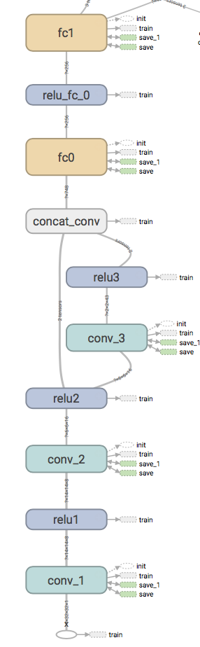

#### 3. Describe how you trained your model. The discussion can include the type of optimizer, the batch size, number of epochs and any hyperparameters such as learning rate.

To train the model, I chose:  
optimizer = Adam  
batch size = 100  
epochs = 100  
learning rate = 0.001
loss operation = cross entropy

Given the above parameters, training process which minimise the cross entropy is shown as the image:
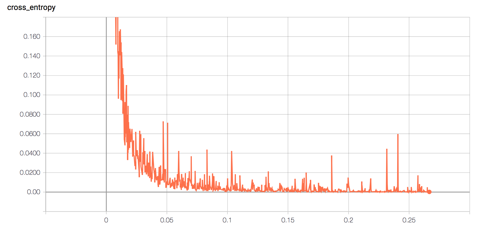

#### 4. Describe the approach taken for finding a solution and getting the validation set accuracy to be at least 0.93. Include in the discussion the results on the training, validation and test sets and where in the code these were calculated. Your approach may have been an iterative process, in which case, outline the steps you took to get to the final solution and why you chose those steps. Perhaps your solution involved an already well known implementation or architecture. In this case, discuss why you think the architecture is suitable for the current problem.

My final model results were:
* training set accuracy of 100%
* validation set accuracy of 95.5%
* test set accuracy of 94.1

The iteration of architecture change and parameter tuning is shown as the following image.
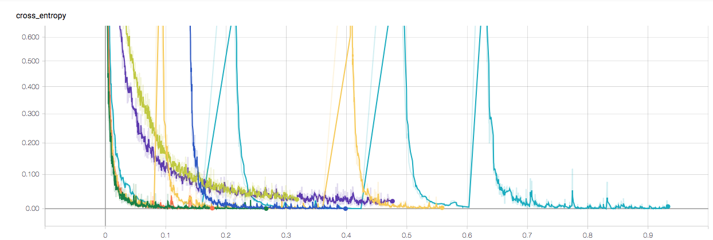
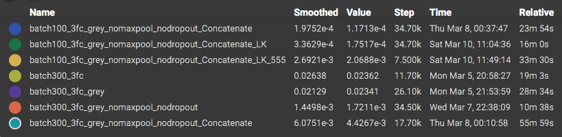
(Please note the Value here is not the best cross_entropy of each model. It is just the output of the last epoch)

The first architecture is called __batch300_3fc__ in my project. The batch size = 300, dropout = 0.9. It is based the architecture of LeNet. According to the Udacity example code, I created the CNN architecture based on tensorflow in fast way.
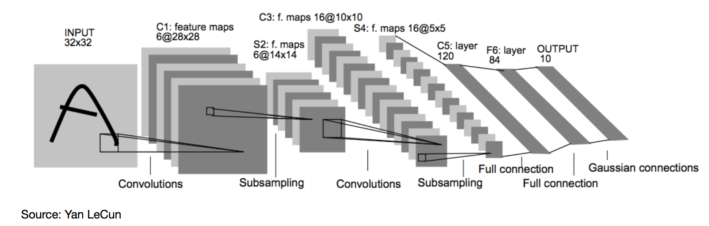

As expected, the performance(accuracy of prediction) needed to be improved. I first changed the RGB input to greyscale input. It generated the model: __batch300_3fc_grey__

Then I tested the effects of maxpooling layers and dropouts. Given the inspiration of NVIDA CNN architecture. I used (2,2)stride to replace the maxpooling layers. It significantly increased the training speed. The generated model is called __batch300_3fc_grey_nomaxpool_nodropout__

Inspired by the [published base line model from Pierre Sermanet and Yann LeCun ](http://yann.lecun.com/exdb/publis/pdf/sermanet-ijcnn-11.pdf), I noticed the  __concatenation layer__ shows a very positive potential on classification problems.
Given this concept, the architecture was updated to. __batch300_3fc_grey_nomaxpool_nodropout_Concatenate__. The performance was improved accordingly.

To even push the performance, I went on Slack to see what parameters people were using. It shown that many solutions set batch_size at 100 level.  So I tried to decreased the batch_size to 100: __batch300_3fc_grey_nomaxpool_nodropout_Concatenate__. The performance improved. It also accelerated the training process.

Again, inspired by the base line model, I tried to increase the kernel size of convolutional layer. Many examples(Large Scale Visual Recognition Challenge) shows the small kernel size gives better performance in deep neural network. But in our case, it is different. It may be caused by the small amount(3 layers) of convolutional layers. Besides it is not the larger the better, as show on model __batch300_3fc_grey_nomaxpool_nodropout_Concatenate_LK_555__ with all 5x5 kernel size in convolutional layers.  At last, the model __batch300_3fc_grey_nomaxpool_nodropout_Concatenate_LK__ presented the best performance with the kernel size of (5x5, 3x3, 3x3) for 3 convolutional layers.

### Test a Model on New Images

#### 1. Choose five German traffic signs found on the web and provide them in the report. For each image, discuss what quality or qualities might be difficult to classify.

Here are five German traffic signs that I found on the web:

- The first image might be difficult to classify because there is no >10% border around the traffic sign which is not fits the restriction of the [GTSRB dataset](http://benchmark.ini.rub.de/?section=gtsrb&subsection=dataset)

- The background of image 2 might affect the classification.
- Image 3 is easy to be classified.
- The lightness of the image 4 might affect the classification.
- In image 5, the colour of the backgound and the traffic sign are very close.

#### 2. Discuss the model's predictions on these new traffic signs and compare the results to predicting on the test set. At a minimum, discuss what the predictions were, the accuracy on these new predictions, and compare the accuracy to the accuracy on the test set (OPTIONAL: Discuss the results in more detail as described in the "Stand Out Suggestions" part of the rubric).

Here are the results of the prediction:

| Image			        |     Prediction	        					|
|:---------------------:|:---------------------------------------------:|
| Right-of-way at the next intersection      		| Right-of-way at the next intersection   									|
|Speed limit (30km/h)     			| Speed limit (120km/h)										|
| Priority road					| Priority road											|
| Keep right	      		| Keep right					 				|
| Turn left ahead			| Turn left ahead      							|

The model was able to correctly guess 4 of the 5 traffic signs, which gives an accuracy of 80%. This compares favorably to the accuracy on the test set of 94.1%.

#### 3. Describe how certain the model is when predicting on each of the five new images by looking at the softmax probabilities for each prediction. Provide the top 5 softmax probabilities for each image along with the sign type of each probability. (OPTIONAL: as described in the "Stand Out Suggestions" part of the rubric, visualizations can also be provided such as bar charts)

The top five soft max probabilities of each prediction for target image were presented here:

<table class="tg" style="undefined;table-layout: fixed; width: 874px">
<colgroup>
<col style="width: 119px">
<col style="width: 151px">
<col style="width: 151px">
<col style="width: 151px">
<col style="width: 151px">
<col style="width: 151px">
</colgroup>
  <tr>
    <th class="tg-s6z2">Category Indices</th>
    <th class="tg-s6z2" colspan="5">Prediction</th>
  </tr>
  <tr>
    <td class="tg-s6z2" rowspan="2">Right-of-way at the next intersection (11)</td>
    <td class="tg-s6z2">11</td>
    <td class="tg-s6z2">1</td>
    <td class="tg-baqh">30</td>
    <td class="tg-baqh">13</td>
    <td class="tg-baqh">25</td>
  </tr>
  <tr>
    <td class="tg-s6z2">8.56060266e-01</td>
    <td class="tg-s6z2">9.38271061e-02</td>
    <td class="tg-baqh">1.64848696e-02</td>
    <td class="tg-baqh">1.28628053e-02</td>
    <td class="tg-baqh">3.67925433e-03</td>
  </tr>
  <tr>
    <td class="tg-s6z2" rowspan="2">Speed limit (30km/h) (1)</td>
    <td class="tg-s6z2">8</td>
    <td class="tg-s6z2">5</td>
    <td class="tg-baqh">32</td>
    <td class="tg-baqh">7</td>
    <td class="tg-baqh">18</td>
  </tr>
  <tr>
    <td class="tg-s6z2">5.21232247e-01</td>
    <td class="tg-s6z2">2.91508883e-01</td>
    <td class="tg-baqh">8.45697373e-02</td>
    <td class="tg-baqh">3.37951146e-02</td>
    <td class="tg-baqh">1.84052996e-02</td>
  </tr>
  <tr>
    <td class="tg-s6z2" rowspan="2">Priority road (12)</td>
    <td class="tg-s6z2">12</td>
    <td class="tg-s6z2">15</td>
    <td class="tg-baqh">9</td>
    <td class="tg-baqh">14</td>
    <td class="tg-baqh">10</td>
  </tr>
  <tr>
    <td class="tg-baqh">9.97318923e-01</td>
    <td class="tg-baqh">1.49013393e-03</td>
    <td class="tg-baqh">1.02273002e-03</td>
    <td class="tg-baqh">4.24535647e-05</td>
    <td class="tg-baqh">3.89280540e-05</td>
  </tr>
  <tr>
    <td class="tg-baqh" rowspan="2">Keep right (38)</td>
    <td class="tg-baqh">38</td>
    <td class="tg-baqh">8</td>
    <td class="tg-baqh">2</td>
    <td class="tg-baqh">3</td>
    <td class="tg-baqh">26</td>
  </tr>
  <tr>
    <td class="tg-baqh">9.98496294e-01</td>
    <td class="tg-baqh">7.40246731e-04</td>
    <td class="tg-baqh">3.34476819e-04</td>
    <td class="tg-baqh">1.35276627e-04</td>
    <td class="tg-baqh">9.12777687e-05</td>
  </tr>
  <tr>
    <td class="tg-baqh" rowspan="2">Turn left ahead (34)</td>
    <td class="tg-baqh">34</td>
    <td class="tg-baqh">9</td>
    <td class="tg-baqh">32</td>
    <td class="tg-baqh">8</td>
    <td class="tg-baqh">36</td>
  </tr>
  <tr>
    <td class="tg-baqh">9.09583390e-01</td>
    <td class="tg-baqh">7.02597424e-02</td>
    <td class="tg-baqh">6.52423315e-03</td>
    <td class="tg-baqh">1.92943611e-03</td>
    <td class="tg-baqh">1.68436370e-03</td>
  </tr>
</table>

Bar chart was used to visualize the prediction results of the above 5 images:

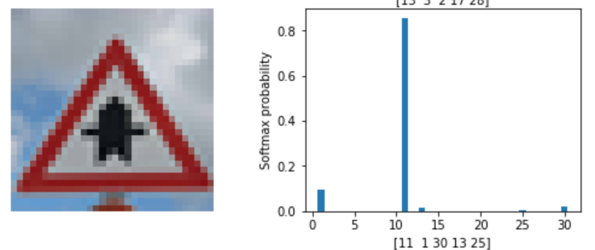
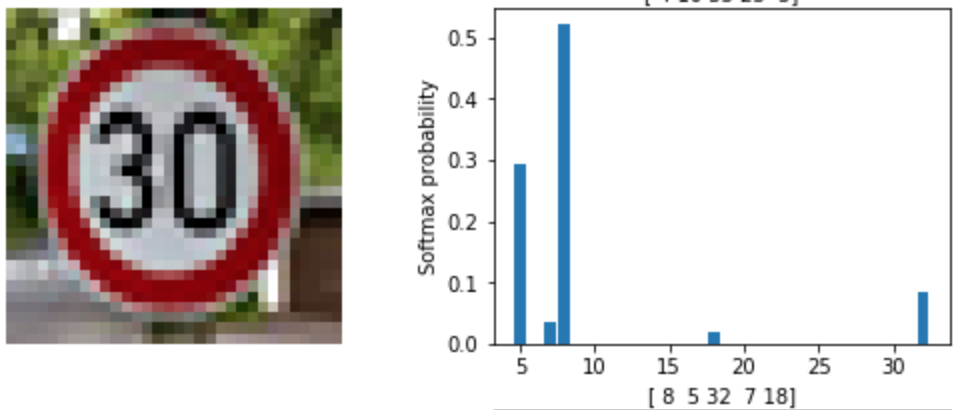
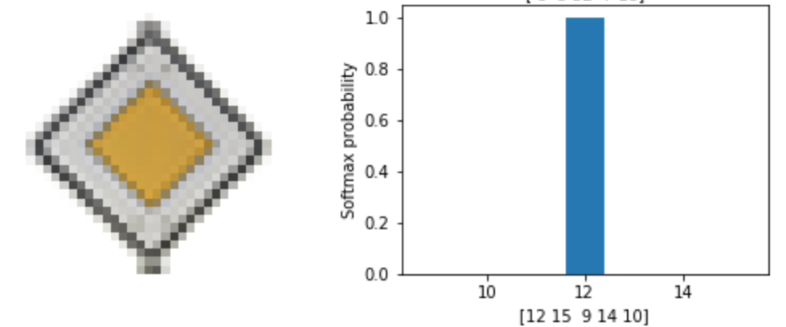
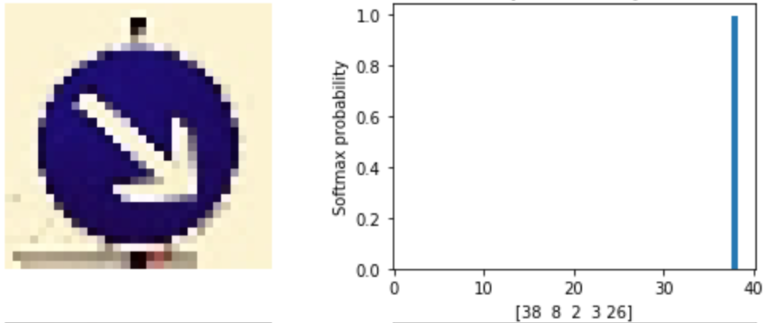
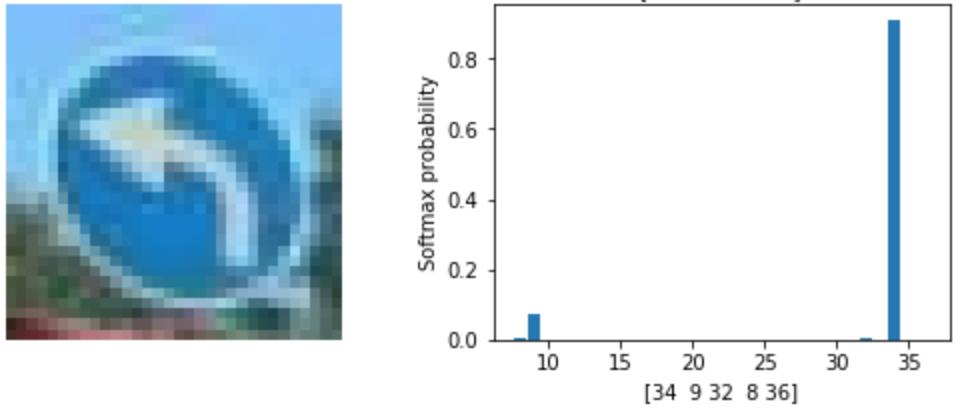

### (Optional) Visualizing the Neural Network (See Step 4 of the Ipython notebook for more details)
#### 1. Discuss the visual output of your trained network's feature maps. What characteristics did the neural network use to make classifications?
